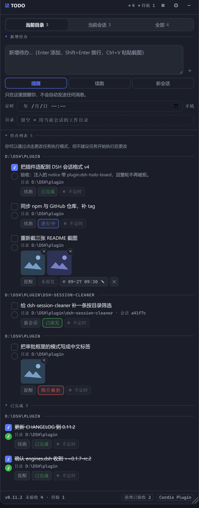
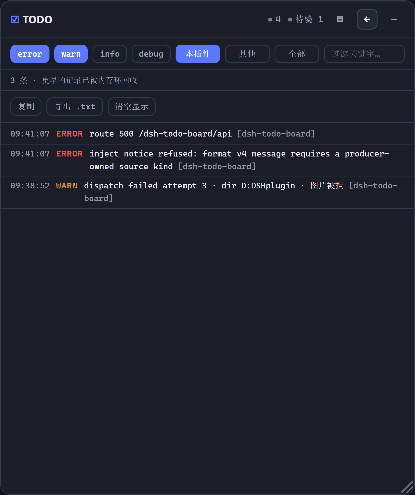
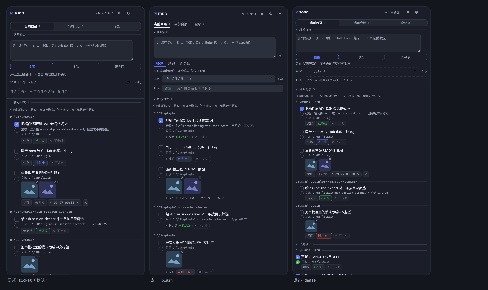

# dsh-todo-board

**给 DeepSeek Harness（DSH）agent 的一块跨会话 TODO 板：一次只派一件事，干完它自己去拿下一件。**

**A cross-session TODO board for DeepSeek Harness: hand the agent one task at a time, and it picks up the next one by itself.**

[](https://github.com/topics/dsh-plugin)
[](LICENSE)
[](package.json)
[](package.json)



---

## 它解决什么 / Why

让 AI 干完一件事之后，**自己**去待办板里找同一目录下还没做完的下一件继续干 —— 不用你盯着逐个验收，也不用一次把一堆任务塞给它、结果每件都做得半吊子。

Let the agent finish one thing, then look up the next unfinished task **in the same working directory** and keep going. No babysitting each step, no dumping a pile of tasks on it at once and getting five half-done jobs back.

具体来说：待办按**工作目录**分组，列表顺序就是执行顺序；每条待办自己带一档执行模式（只提醒 / 自动续跑 / 自动新开会话）；AI 干完勾自己的左勾，你验收勾右勾，右勾才真正了结它。

- **面板**是一个浮窗（`shell.overlay`），拖动、缩放、折叠都在里面，位置和尺寸记在 `localStorage`。
- **板子是全局单文件**：`${DSH_HOME}/todo-board/board.json`，原子写入。面板内按目录分组显示。

## 功能一览 / What you get

| 能力 | 一句话 |
| --- | --- |
| [跨会话自动接续](#三档执行模式--run-modes) | 回合结束时把同目录下一条未完成待办交给当前会话或新会话 |
| [三档执行模式](#三档执行模式--run-modes) | 提醒 / 自动续跑 / 自动新开会话，每条待办独立选 |
| [任务状态](#任务状态--task-states) | 每行都有且只有一个状态标签，从实时会话列表推导，永不落盘 |
| [卡住会自愈](#卡住的行不会静默卡死--a-stranded-row-recovers-itself) | 派发失败记 `lostAt` 并按退避重试，绝不静默退休 |
| [图片附件](#图片附件--attached-images) | `Ctrl+V` 粘贴截图，最多 4 张，派发时是**真正的图片** |
| [定时执行](#定时执行--scheduled-execution) | 本地时间到点才派发，列表里随时可改 |
| [双勾选](#双勾选--two-checkboxes) | 方形是 AI 自己勾的，圆形是你的验收；右勾才了结 |
| [界面风格](#界面风格--skins) | 票据 / 素白 / 紧凑三套，一键循环切换 |
| [开发者日志](#开发者日志--developer-log) | 面板内切页看日志，出错才亮小圆点，默认只记本插件 |
| [长任务先规划](#长任务先规划--plan-a-long-task-first) | 明显分多步时先问你要不要拆，`/todo` 一键注入模板 |
| [模型工具与审批门](#模型工具--the-todo_board-tool) | AI 改板子走 DSH 原生审批框，不问就执行不了 |

## 安装 / Install

```sh
dsh plugin --profile web add dsh-todo-board          # 从 npm 安装 / from npm
dsh plugin --profile web add <git-url-or-path>       # 或从仓库/本地目录 / from a repo or local path
```

安装后**重启 Profile**（重新执行 `dsh web`）才会装载 —— 本插件是 host 组合里的一行，不是运行时热加载。

Restart the profile afterwards (`dsh web` again): the plugin is a row in the host composition, not a runtime hot-load.

卸载 / Uninstall:

```sh
dsh plugin --profile web remove dsh-todo-board
```

### DSH 版本要求 / DSH version requirement

**本插件 0.11.3 起要求 DSH ≥ 0.1.7-rc.2（session format v4）。**

**As of 0.11.3 this plugin requires DSH ≥ 0.1.7-rc.2 (session format v4).**

| 你的 DSH | 装哪个版本 / Install | 为什么 / Why |
| --- | --- | --- |
| ≥ 0.1.7-rc.2 | `dsh plugin --profile web add dsh-todo-board` | 当前版本 / current |
| ≤ 0.1.6（含 `0.1.5-rc.3`） | `dsh plugin --profile web add dsh-todo-board@0.6.1` | 最后一版 v3 兼容版本 / last v3-era release |

插件往会话里注入待办时会带一个**生产者自有的 source**（`{ kind: 'plugin:dsh-todo-board', form: 'notice' }`）。这是 DSH **会话格式 v4** 的硬性要求（`format v4 message requires a producer-owned source kind`）；旧 v3 的写法 `{ kind: 'plugin', plugin: … }` 会被持久化层直接拒绝，而**拒绝会带走整个回合**——不只是那条提示。v4 从 DSH **0.1.7-alpha.1** 开始提供，**0.1.7-rc.2 是第一个正式发布**。

The messages this plugin injects carry a **producer-owned source** (`{ kind: 'plugin:dsh-todo-board', form: 'notice' }`). Session format **v4** requires exactly that; the retired v3 wrapper `{ kind: 'plugin', plugin: … }` is refused, and the refusal **fails the whole turn**, not just the notice.

> **装错版本没有安装期告警 —— 这是实测的，不是推测。** `package.json` 里的 `engines.dsh` 只是一个**声明**：npm 只校验它认识的引擎名（`node` / `npm`），自定义引擎名不参与检查。实测在 DSH 0.1.5 / 0.1.6 下安装本插件，**不会有** `EBADENGINE` 警告。所以上表请自己对着看。
>
> **No install-time warning fires for a mismatched version — measured, not assumed.** `engines.dsh` is a **declaration only**: npm validates the engine names it knows (`node`, `npm`), and a custom name is not checked. Installing this plugin against DSH 0.1.5 / 0.1.6 produces **no** `EBADENGINE` warning.
>
> 装错版本的**实际表现是运行时报错，而且报得很直白**：DSH ≥ 0.1.7 会拒绝我们写出的消息，DSH ≤ 0.1.6 那边则没有 v4 的那套校验，两条路都会**带着整个回合一起失败**，原因会写进插件日志。
>
> A mismatch shows up as a **runtime failure of the whole turn**, with the reason in the plugin log.

旧版本（**≤ 0.11.2，含 npm 上发过的 0.4.1 / 0.5.0 / 0.6.1**）不会自动升级 —— 升级 DSH 之后请一并升级本插件。

Releases up to **0.11.2** (including the published `0.4.1` / `0.5.0` / `0.6.1`) do not carry this adaptation: after upgrading DSH, upgrade the plugin too.

## 快速上手 / Quick start

1. 右上角出现浮窗，输入一条待办，选执行模式，点「添加」。
2. 让 AI 去做这件事。它做完会调用 `todo_board action=done` 给自己打左勾，然后查同目录下一条。
3. 你验收后点右勾；底部「清理已验收」批量清掉。

1. Type a task into the floating panel, pick a run mode, hit add.
2. Let the agent work. When it finishes it calls `todo_board action=done` to tick its own box, then looks for the next task in the same directory.
3. After you verify, tick the right-hand box; 「清理已验收」 clears the verified ones.



## 三档执行模式 / Run modes

每条待办在新增时必须选一档（默认「提醒」）。Each task carries exactly one mode, chosen when you add it.

| 模式 | 行为 | Behaviour |
| --- | --- | --- |
| 提醒 | 不自动做任何事，等你在浮窗里点 ▶ | Nothing automatic; you press ▶ when you want it |
| 自动续跑 | AI 回合结束时，把同目录下一条待办注入**当前会话**继续跑 | At turn end, inject the next task in the same directory into the **current session** |
| 自动新会话 | AI 回合结束时，新建一个同目录会话并执行该待办 | At turn end, create a **new session** in the same directory and run the task there |

新增框里的「目录」一行决定这条待办**归属哪个目录**：它决定分组标题、决定「当前目录」筛选里能否看到它，也决定回合结束后由哪个会话来接续它。**留空 = 跟随当前会话的工作目录**（该框的提示文字会写明这一点）。

The composer's 目录 field decides **which directory a task belongs to**: it drives the group heading, whether the 当前目录 filter shows it, and which session picks it up at turn end. **Empty means "follow the current session's working directory"**.

派发顺序 = 面板里**从上到下**的顺序。拖动行首 `⠿` 调整，顺序持久化。

Dispatch order is the panel's **top-to-bottom** order. Drag the `⠿` handle to change it; the order is persisted.

「自动新会话」第一次派发时创建会话，并把它**绑定**到这条待办上：之后 ▶ 或回合结束自动接续都复用同一个会话，不会一次运行开一个会话。绑定会话已不在（比如你把它删了）时，下一次派发才会再开一个新的；想手动换一个新会话，点行上的 `会话 … ✕` 解绑即可。

A `自动新会话` task opens its session once and **binds** it to the row: later ▶ presses and turn-end handoffs reuse that same session instead of opening another. Only a dead binding — or clicking the `会话 … ✕` chip to unbind — makes the next dispatch open a fresh one.

新会话会被登记进待办目录所属的**工作区**，侧栏里和手动开的会话一样归组（不是「未分组」）。

## 任务状态 / Task states

每条待办的状态由 host 从**实时会话列表**推导（不落盘，避免与实际时间戳不一致）。**每一行都带且只带一个状态标签**，因为需要靠推断才知道的状态等于看不见：

| 状态 | 面板标签 | 含义 |
| --- | --- | --- |
| 未派发 | `未派发`（稍暗） | 还没交给任何会话；▶ 可点 |
| 已派发 | `已派发`（绿） | 已交给会话，目标会话还活着 |
| 进行中 | `进行中`（蓝） | 目标会话此刻正在跑 |
| 已完成 | `已完成`（绿字） | AI 打了左勾，或你打了右勾 |
| 目标会话丢失 | `目标会话丢失`（红） | 派发时找不到目标会话，悬住了 |

Every task's state is derived host-side from the **live session list** (never persisted, so it cannot drift from the timestamps it describes). **Every row carries exactly one state chip**, because a state you have to infer is a state you cannot see:

| State | Chip | Meaning |
| --- | --- | --- |
| 未派发 pending | `未派发` (dimmed) | Never handed to a session; ▶ is live |
| 已派发 dispatched | `已派发` (green) | Handed over, target session still alive |
| 进行中 running | `进行中` (blue) | The target session is working on it right now |
| 已完成 done | `已完成` (green text) | The agent ticked it, or you verified it |
| 目标会话丢失 lost | `目标会话丢失` (red) | Dispatch found no session to land in |

强调程度分级，所以一屏普通待办不会吵：只有 `进行中` 和悬住的行显眼。`已完成` 的**划线**只跟验收走（那是你自己勾的），所以 AI 勾完但你没验收的行会显示「已完成」而依然清晰可读。

Emphasis is graded, so a board of ordinary rows stays quiet: only 进行中 and a stuck row shout. The **strikethrough** stays tied to verification (your own tick), so an AI-finished row reads `已完成` while remaining legible.

「悬住」的原因不止一种，面板会按实际原因显示：`目标会话丢失`（会话不在了）、`图片被拒`（模型不接受图片——会话是好的，别冤枉它）、`建会话失败`、`预设解析失败`、`服务不可用`。悬住的行 tooltip 里会写清原因和出路。

A parked row is labelled by its **actual** cause: `目标会话丢失` (the session is gone), `图片被拒` (the model refuses images; the session is fine, so don't blame it), `建会话失败`, `预设解析失败`, `服务不可用`. The row's tooltip names both the cause and the way out.

**▶ 只能在「未派发」时点击。** 已经派发过的待办重复派发只会产生重复工作，而无处可去的待办应该先改模式或换目录，而不是被塞给"当前恰好开着的"那个会话。

**▶ only works while a task is 未派发.** Re-dispatching a task that was already handed over just duplicates work, and a task with nowhere to go should be re-targeted rather than pushed into whatever session happens to be open.

### 卡住的行不会静默卡死 / A stranded row recovers itself

**派发失败不会盖上「已派发」的戳。** 那个戳的含义是"已经发出去了"，而调度器和回合结束钩子都会按它跳过——盖上就等于把这条待办永久退休，而它其实一次都没跑过。取而代之的是记录 `lostAt`，并按退避自动重试：首次 1 分钟后，逐次翻倍，最多半小时一次。改执行模式、换目录、解绑会话都会立刻清掉这个标记让它重新排队。卡住的待办也不会挡住队列后面的条目。

A failed dispatch does **not** stamp `dispatchedAt` — that stamp means "already sent", and both the scheduler and the turn-end hook skip on it, so stamping it retired the task forever while it never actually ran. It records `lostAt` instead and retries with backoff: one minute, then doubling, capped at half an hour. Changing the mode, the directory, or the session binding clears the marker and re-queues it immediately.

**任何派发失败都不会让 host 卡死。** 所有失败路径（找不到会话、新建会话失败、preset 解析失败、图片被拒）都记下 `lostAt` 并进入退避。这不只是为了显示好看：一条永远「到期」却又从不留下任何状态戳的待办，会让调度器的重试链纯靠微任务自我循环——事件循环一次都跑不到，整个 host 冻结。`tools/retry-loop.mjs` 是这条性质的回归守卫，已并入 `npm test`。

**And no dispatch failure can freeze the host.** Every failure path records `lostAt` and backs off. That is not just cosmetic: a row that stays permanently "due" while recording no state stamp at all makes the scheduler's retry chain re-enter through microtasks alone — the event loop never runs and the whole host freezes. `tools/retry-loop.mjs` guards that property.

## 图片附件 / Attached images

待办可以带图片（最多 4 张，PNG / JPG / WebP / GIF）。图片存进 DSH 的**附件库**，派发时作为**真正的图片**和提示词一起发给模型——不是把文件名写进文字里。

A task may carry images (up to 4; PNG / JPG / WebP / GIF). They are stored in DSH's **attachment store** and dispatched as **real images** alongside the prompt — not as filenames written into text.

- **在新增框里直接 `Ctrl+V` 粘贴截图**即可附图（最多 4 张），粘完显示缩略图，点缩略图移除。原来的「📎 图片」选文件按钮已删除 —— 截图、复制图片之后顺手一粘，比「先存成文件、再点按钮、再在对话框里找那个文件」短得多。行上的缩略图点击可放大，✕ 移除单张。
  - **输入框空着时没有任何常驻提示**：能力由 placeholder 里的 `Ctrl+V 粘贴截图` 说明，附图区只在真的附了图之后才出现（那时它显示 `已附 N / 4 张`）。没人附图的常见情况下，面板不为一个可能用不上的功能占一行。
  - **纯文本粘贴不受影响**：只有剪贴板里真的带图片时才会拦截粘贴；粘文字进输入框照旧，这是写待办的主要方式，不能为了附图把它弄坏。
  - 一次粘太多会**粘满为止并告知**（「只粘贴了前 N 张」），而不是静默丢掉或者整批拒绝。
  - 剪贴板图片有时**不带 MIME 类型**（某些截图工具如此）。这种会按文件名的扩展名补上类型再交给 host —— host 对媒体类型是严格校验的，不补会被直接拒收。
- **Paste a screenshot straight into the composer** with `Ctrl+V` (up to 4). The old 「📎 图片」 file-picker button is gone: a screenshot is already an image, and saving it to a file first only to find it in a dialog is the long way round.
  - **Nothing sits in the composer while it is empty.** The capability is named by the placeholder's `Ctrl+V 粘贴截图`, and the attachment area appears only once an image is actually attached (showing `已附 N / 4 张`). The common case — nobody attaching anything — does not spend a row on a feature that may go unused.
  - **Text pasting is untouched.** The paste is intercepted *only* when the clipboard really carries an image.
  - An over-large batch **fills what fits and says so**, rather than dropping silently or refusing the whole paste.
  - A clipboard image sometimes arrives with **no MIME type**; the media type is then taken from the filename's extension — the host validates it strictly and would otherwise refuse the image outright.
- 上限、媒体类型与归一化都用 harness 自己那套（同一条 `attachments.saveImage` 通路），不是本插件自己定的规则。
- 图片字节由本插件自己的 `GET /dsh-todo-board/image?id=…` 提供：harness 自带的图片读取是**会话作用域**的（只认会话日志里引用过的附件），而待办的附件存在板上，所以板自己当权威——没被任何待办引用的 id 一律 404。
- **目标模型必须支持图片**：派发前会查模型是否声明了 `image`。文本模型（如 `deepseek-v4-flash`）会直接提示「目标会话的模型不接受图片输入」，而不是让适配器抛 `UNSUPPORTED_CONTENT`。这是 DSH 的模型声明问题，不是插件的限制。

- Limits, media types and normalization come from the harness' own attachment admission.
- Bytes are served by this plugin's `GET /dsh-todo-board/image?id=…`, because the shipped image route is **session-scoped** and would refuse an attachment no session log references. The board is the authority instead: an unreferenced id is a 404.
- **The target model must accept images.** Dispatch checks the model's declared modalities first and reports a clear message for a text-only model.

## 定时执行 / Scheduled execution

每条待办都可以带一个**本地时间**（`YYYY-MM-DDTHH:mm`，分钟精度）。到点之前这条待办不会被派发；到点之后 DSH 按它自己的模式执行它 —— 就像你此刻按了 ▶ 一样。

Any task may carry a **local time** (`YYYY-MM-DDTHH:mm`, minute precision). Before that minute the task is not dispatched; when it arrives, DSH runs it in its own mode, exactly as if you had pressed ▶ at that moment.

- 新增框里的「定时」一行用浏览器的时间选择器挑时间；留空 = 立即可执行。
- **列表里的待办也能改定时**：没定时的行显示 `🕓 不定时`，点一下就地展开时间选择器；已定时的行点时间标签打开同一个选择器（带着当前时间），改完 `Enter`/`✓` 保存、`Esc` 取消。标签旁的 `✕` 单独取消定时。
- 行上的定时标签显示时间，**已到点**会变黄。
- 每行只把同一件事说一遍：**目录**在标题下的小字里给完整路径（行下方的目录标签已去掉），**定时**在下方标签里（小字里的「定时 / 不定时」已去掉）。
- `提醒` 模式到点只弹一条桌面通知（需要浏览器通知权限），不会自动给模型发消息；`自动续跑` / `自动新会话` 到点才真正派发。
- 定时只判一次：派发过（或被提醒过）就不再重复触发。错过的时间（DSH 当时没运行）会在下次启动后立刻补上。
- 时间用**主机本地时区**解释；面板存的就是你选的那一刻。

- The composer's 定时 row uses the browser's own picker; empty means "runnable now".
- **A task already on the list can be rescheduled**: an unscheduled row shows `🕓 不定时` — click it to open a picker in place; a scheduled row opens the same picker seeded with its current time. `Enter`/`✓` saves, `Esc` cancels, and the `✕` beside the chip clears the time.
- The row chip shows the time and turns yellow once due.
- Each fact is stated once per row: the **directory** appears as a full path in the small print under the title, the **schedule** lives in the chip below.
- `提醒` mode only raises a desktop notification at that minute (browser permission required); `自动续跑` / `自动新会话` dispatch for real.
- A time fires once: a dispatched or reminded row never fires again. A time missed while DSH was not running fires on the next start.
- Times are interpreted in the **host machine's local zone**.

## 双勾选 / Two checkboxes

| 勾 | 谁勾 | 含义 |
| --- | --- | --- |
| 左（方框） | 模型自己调 `todo_board action=done`，也可手点 | AI 已完成，等你验收 |
| 右（圆框） | 只有用户 | 已验收，真正了结 |

只有**右勾**才把待办从未完成列表里移除。系统提示段落明确禁止模型代勾右勾。

勾上右勾时这一行**从「待办列表」移走、进入「已完成」区块** —— 不是变灰留在原地，是真的换了一个列表。新区块在待办列表和面板之间，**最近验收的排在最上面**（所以你刚勾的那条就在眼前），按目录分组，同样可折叠。再点一次那个圆勾就撤销验收，行会回到待办列表。已完成的行不参与执行顺序：没有拖柄、也不能被拖成落点（`▶` 与 ✕ 仍然可用）。

Only the right-hand box closes a task, and it **moves the row** into the 已完成 section rather than dimming it in place — newest first, grouped by directory, un-tickable back. The prompt section explicitly forbids the model from ticking it. Completed rows are out of the queue: no drag handle and no drop target (`▶` and ✕ still work).

## 界面风格 / Skins

三套界面，标题栏的 `▤` 循环切换。**默认那套就是原来的样子**，所以不切的人什么都不会变。

Three skins, cycled by the `▤` in the title bar. **The default is exactly the look that shipped**, so not switching changes nothing.



| 界面 | 按钮 | 它改什么 |
| --- | --- | --- |
| 票据 `ticket` | `▤` | 默认：细线分隔、等宽数字、带框的状态标签 |
| 素白 `plain` | `◻` | 去掉卡片边框与各处分隔线，留白更多；状态标签收成一个色点，只有「进行中」和悬住的行留一个淡底 |
| 紧凑 `dense` | `≣` | 结构同票据，字号行距各降一档，图片缩略图变小 —— 一屏能看更多条 |

| Skin | Glyph | What it changes |
| --- | --- | --- |
| 票据 `ticket` | `▤` | Default: hairline rules, tabular monospace, boxed state chips |
| 素白 `plain` | `◻` | No card frame, no dividers, more air; a state collapses to a coloured dot, with a tinted pill only for 进行中 and a stuck row |
| 紧凑 `dense` | `≣` | Same structure as ticket at a smaller type scale and tighter rows |

**三套界面里，控件一个不多一个不少，意思也不变。** 方形的是「AI 已完成」、圆形的是「已验收」，这在三套里都一样：那是含义，不是装饰。切换只动外观，不动任何一条数据，也不碰 DSH 的其他界面 —— 每个皮肤规则都限定在本面板根节点之下（`npm run test:browser` 会在真实浏览器里验证这条）。

**All three keep every control, and each control keeps its meaning.** The square box is "AI finished" and the round one is "you verified it" in all three skins — that is meaning, not decoration. Switching changes appearance only: no task data is touched, and the rest of the DSH interface is never affected, because every skin rule is scoped under this panel's root node.

皮肤是**只加不改**的样式表：基础样式表描述 `ticket`，另外两套只声明自己不同的地方。所以某条声明写错时，退回去的是「原来那套界面」，而不是「没有样式」。

Each skin is an additive stylesheet: the base sheet *is* the `ticket` definition, and the other two declare only their differences — so a bad declaration degrades to the shipped look rather than to an unstyled panel.

## 面板操作 / Panel

- **折叠为一行**：标题栏右侧的 `–` 把整板收成一行 —— `TODO · 未完成数 · 下一条待办 · 待验 N`，点这一行任意位置展开。平时挂着不占地方，扫一眼就知道还剩什么。
- **切换界面**：标题栏的 `▤` 在三套界面之间循环，按钮上的字形就是当前那套，悬停会说明它改了什么。选择记在 `localStorage`（`dsh.todoBoard.skin.v1`），刷新后保持；已折成一行时也一样生效。
- **区块折叠**：面板内部三个区块（新增待办 / 待办列表 / 已完成）各自可折叠，点区块标题切换，`▾` 展开、`▸` 已折叠。折叠状态记在 `localStorage`，刷新后保持。
- **底部状态线（不可折叠）**：左下方常显 **版本号** 与 **未验收数量**（有 AI 完成待验收时追加 `· 待验 N`）—— 它们不再是可折叠区块，所以不会被折起来后"看不见就当没有"。同一行右侧是两条功能入口：`清理已验收 N`（清空已完成列表）与 `Cordis Plugin`（打开 Cordis 面板）。日志页打开时这条线不显示。
- **拖动 / 缩放**：拖标题栏移动，右下角 `◢` 缩放；位置与尺寸存进 `localStorage`，刷新保留；双击标题栏或拖柄还原。**窗口变窄时面板会自动收回视野内**（含浏览器缩放），所以它不会被裁到屏幕外；窗口再拉宽时回到你放它的地方。
- **筛选**：当前目录 / 当前会话 / 全部，每段带未完成计数。
- **行内编辑**：双击标题改名；点模式标签在 提醒 → 续跑 → 新会话 之间循环切换；点定时标签改时间（未定时的行显示 `🕓 不定时`，点它即可加上）。**列表内部有一行小字说明这件事：点模式标签可以改执行模式，但任务开始执行后不建议再改**（列表为空时不显示 —— 那时没有模式可改）。
- **备注（note）**：有备注的行会在标题下方显示备注正文（最多 2 行，紧凑界面 1 行，鼠标悬停可看全文）。行尾的「＋ 备注 / ✎ 备注」是它**自己的**控件：点开是一个独立的多行文本框，`Enter` 保存、`Shift+Enter` 换行、`Esc` 取消，或点「保存 / 取消」。备注**不裁剪、不设长度上限**，因为它是派发时一起发给模型的上下文 —— 面板必须让你在派发前看到它。
- **多行输入**：新增框自动增高（3 行起步，最高 180px），`Enter` 添加、`Shift+Enter` 换行、`Ctrl+V` 粘贴截图附图。
- **开发者日志**：标题栏的 `⚙` 在同一个浮窗内切到日志页。平时用不到；出错时按钮上亮一个小圆点，点开看完即清。
- **Cordis 入口**：侧边栏底部的 `Cordis Plugin` 按钮折起，入口移到本面板底部；点它打开原面板，面板出现在**本面板正下方**（右对齐、互不覆盖）。找不到入口时按钮会变灰并给出提示。

- **Park as one line**: the `–` in the title bar collapses the whole board to a single line — `TODO · open count · next task · 待验 N`. Click anywhere on that line to unfold. It stays out of the way until you need it.
- **Switch the look**: the `▤` in the title bar cycles three skins; the button's glyph *is* the current skin. The choice persists in `localStorage` and applies to the parked one-line view too — no trip to a settings page.
- **Section folding**: the composer, the open list and the completed list each fold away from their own header. The folded set is kept in `localStorage` across reloads.
- **Status line (not foldable)**: the bottom-left always shows the **build marker** and the **open count** (plus `· 待验 N`). It is deliberately not a section: a fact you have to unfold to read can be folded away and then lie by omission.
- **The 已完成 list**: ticking a row's round box moves it out of 待办列表 and into the 已完成 section — a move, not a dimmed copy left behind.
- **Note**: a row with a note shows it under the title, clamped to two lines (one in the dense skin, full text on hover). The note is never trimmed and never capped, because it is the context dispatched to the model.
- **Developer log**: the `⚙` in the title bar swaps the panel to a log page in the same window.
- **Drag / resize**: drag the title bar to move, the `◢` corner to resize. Position and size persist in `localStorage`. **A narrower window pulls the panel back into view automatically** (browser zoom included), so it can never be cropped off-screen.

## 开发者日志 / Developer log

标题栏第三个按钮 `⚙` 把面板**在同一个浮窗内**切到日志页（不是新窗口，也不进 DSH 设置页）。
**平时它不出现在你的工作流里**：出问题时按钮上亮一个小圆点，点开看，看完圆点就没了。

- **过滤**：级别（error / warn / info / debug，至少保留一个）、来源（本插件 / 其他插件 / 全部）、关键字。
- **最新记录在最上面** —— 打开它的理由通常就是刚坏掉的那件事。
- **复制** / **导出 .txt** / **清空显示**。清空**只清面板，不动主机上的记录**。
- **默认只记本插件**（自己的 debug 也记，别的插件只收 error）。别的插件那部分**可能含它们的错误上下文**，所以来源默认就是「本插件」；导出前也会提示贴出去之前自己确认一下。
- **日志正文只在日志页打开时才传给浏览器**。关着的时候面板的轮询负载和没有这个功能时**逐字节相同**，只额外带一个数字：有没有新的错误（那个圆点就是这么来的）。

The third title-bar button (`⚙`) swaps the panel to a log page **inside the same floating window** — no new window, and nothing in DSH's settings. It stays out of the way until something breaks, and then a small dot appears on it; opening the page is what clears the dot.

- **Filters**: level (at least one always stays on), source (this plugin / other plugins / all), and a keyword box.
- **Newest first** — the reason you opened it is usually the thing that just broke.
- **Copy** / **Export .txt** / **Clear display**. Clearing drops the panel's copy only.
- **Only this plugin by default** (its own debug included; other plugins contribute `error` only). The export says so before you paste it anywhere.
- **Log text reaches the browser only while the page is open.** Closed, the panel's polling payload is **byte-for-byte what it was before this feature existed**, plus one number: whether anything new went wrong. That number is the dot.

存放位置：`${DSH_HOME}/todo-board/log.ndjson`，一行一条，上限 256 KiB（超了就保留最新一半），文件权限 `0o600`。写不进去时**只是不再落盘，内存日志照常**。

Stored at `${DSH_HOME}/todo-board/log.ndjson`, one record per line, capped at 256 KiB (trimmed to the newest half when it grows past that), mode `0o600`. A failed write **disables the file only** — the in-memory log keeps working.

失败路径都会留痕：派发失败（含**第几次**、目标会话、目录、原因）、读写板失败、建会话 / preset 失败、图片入库失败、路由 500，以及**被信任校验拒绝的请求**（含 host / origin，上限 20 条 —— 否则一个重试循环的页面会把别的都埋掉）。

Every failure path leaves a record: dispatch failures (with the **attempt count**, target session, directory and reason), board read/write failures, session/preset failures, image admission failures, route 500s, and **requests refused by the trust check**.

> **脱敏是承重结构，不是加固。** 密钥从来不是被某处不小心的 `logger.warn(secret)` 记下的，
> 而是夹在**别人构造好的消息**里 —— 通常是配置校验失败时的 `Error.message`（比如 MCP 服务器
> 的 `transport` 少打一个字母，整份配置连同 `env` 和 `Authorization` 头就被打了出去）。
> 所以**每一行落盘前都过脱敏**，导出时**再过一遍**（那个文件是要贴给别人的）。
> 已知未覆盖：JSON dump 里、键名不像密钥、值也没有可识别前缀的密钥。

> **Redaction is load-bearing here, not hardening.** A key never arrives from a careless
> `logger.warn(secret)`; it arrives inside a message someone else composed — usually an
> `Error.message` from config validation. So **every stored line is redacted**, and the
> export runs it **again**. Known gap: a key with no recognizable prefix, under a key name
> that does not look secret, inside a JSON dump.

## 长任务先规划 / Plan a long task first

给模型一个多阶段任务时，它**应该先问一句**要不要用 TODO 板拆成步骤、按顺序做，而不是闷头开干。这个能力由三部分组成，分别给三种人用：

| 谁 | 用什么 | 做什么 |
| --- | --- | --- |
| **模型** | 系统提示段落里的一条规则 | 明显分多步、且**当前目录下还没有待办**时，先问一句「要不要拆」；已经拆过就不再问 |
| **你** | `/todo <目标>` 命令 | 一句话把模板注入当前会话，模型随即给计划 |
| **你/模型** | Skill `todo-board-planning` | 拆分手册（怎么定粒度、note 写什么、模式怎么选），模型按需加载；你也可以 `/todo-board-planning` 直接看 |

### 复制这段给模型

```
用 TODO 板把这件事拆成可执行的步骤，然后按顺序做。

【目标】<一句话说清最终要什么>
【边界】<不要做什么、必须遵守什么>
【完成标准】<怎么算做完；能跑命令/看结果最好>

拆分要求：
1. 每条一句话、彼此有顺序、能独立验收；一条只交付一件事，别把两件事塞一条；
2. 先给我看拆分结果，我确认后再写进板子；我说改就改；
3. 每条待办的备注（note）里写清：验收标准 + 已知的坑/前置条件；
4. 定好顺序后，用一次 action="add" 的 items 把整份计划写进去（一次审批），不要一条一条建。

执行要求：
5. 开始后每做完一条，立刻 action="done" 勾成「AI 已完成」，再取同目录下一条继续，不要停下来问我；
6. 中途要加步骤就告诉我，别自己闷着改范围。

（我没特别说的话：默认拆 3–8 步；建好后用 ask_user_question 问我「就按这个做（立刻开始）／只建清单不开始／我再改改」。）
```

> 这段模板在代码里只有**一处**定义（`PLAN_TEMPLATE`），`/todo` 命令、Skill 正文与本 README
> 共用它；`tools/check-template-parity.mjs` 会逐字比对上面这个代码块，防止"文档里那份悄悄过期"。

### 一次写入整份计划：`add` 的 `items`

拆 8 步如果是 8 次调用，就是 **8 个审批框** —— 所以批量创建是功能的一部分，不是优化：

```json
{"action":"add","dir":"D:\\项目","items":[
  {"title":"抽出日志模块接口","note":"验收：npm test 全绿","mode":"resume"},
  {"title":"补失败路径的单测","note":"验收：覆盖率报告里有失败分支","mode":"resume"}
]}
```

- **一次调用 = 一次审批框**，且框里会**逐条列出每一步的标题**（含"哪些步骤会自动派发"的提示）—— 一次批准覆盖 N 行，只有看得见 N 行才叫同意。
- **任意一条不合法 → 整批一条都不写**（含图片、定时、模式的校验）。跟标题编辑一样是"全有或全无"：半份计划与用户批准的那份不是同一份。
- 上限 **20 条**，超了整批拒绝（不静默截断）：再多就请分两批，让每次审批框里的计划仍然读得完。
- 数组顺序即执行顺序；每步可以有自己的 `mode` / `note` / `schedule` / `images`，`dir` 对外层生效。

### 执行模式怎么选

- `resume`（推荐）：确认后**同一会话**按顺序连跑，上下文连续；
- `newSession`：每步开新会话，适合步骤互相独立、上一步的上下文会误导下一步的长计划；
- `remind`：只建清单不自动跑，你自己点面板 ▶ 开始 —— 说「只列个清单」时用这个。

第一条由谁开始：模型建完后应当用 `ask_user_question` 问你，选「就按这个做（立刻开始）」就等于**你授权了第一步** —— 这既保住了"第一条由用户开始"，又不用为每一步都点一次 ▶。

### 确定性提醒（可关掉的设计说明）

提示词里的规则是"软"的：模型赶时间时可能读过去。所以插件还在 `agent/pre-step` 上加了一道**保守的**判断 —— 当这一步进来的**用户消息**同时满足：

- 长度 ≥ 200 字，**且**
- 出现 ≥ 2 处阶段标记（`1.` / `- ` / `第 N 步` / `首先…然后…最后` / `阶段/步骤/流程`），**且**
- 当前工作目录下**没有未完成的待办**，**且**
- 这个会话**还没被提醒过**（每会话一次）

才追加一句"这看起来不止一步，可以先问用户要不要拆"。

两个阈值都在 `lib/index.js`（`PLAN_NUDGE_MIN_CHARS` / `PLAN_NUDGE_MIN_MARKERS`）。误报的代价是**多问一句**，漏报就是原来的行为；如果你觉得吵，把这两个数字调大即可。

## 模型工具 / The `todo_board` tool

| action | 作用 |
| --- | --- |
| `list` | 列出当前工作目录下未验收的待办（`all: true` 列全部目录），带 id、执行顺序与定时时间 |
| `add` | 新增一条（追加到列表底部），可带 `schedule` 与 `images`；**给 `items` 就能一次写入整份计划（见上）** |
| `done` | 打左勾「AI 已完成」 |
| `reopen` | 撤销左勾 |
| `note` | 追加备注 |
| `schedule` | 设置或取消某条待办的定时时间（`schedule` 传空字符串即取消） |
| `update` | 改标题 / 模式 / 目录 / 备注；**先整体校验再落笔**，一个字段不合法就整条拒绝（不做「好的先改上」） |
| `reorder` | 传 `ids` 指定新的从上到下顺序。**只接受同一个目录内的待办**；未列出的保持原有相对顺序跟在后面 |
| `dispatch` | 立即派发一条待办（等于面板的 ▶）。**只有「未派发」的能派发**，与面板 ▶ 的启用条件一致 |

Actions: `list`, `add` (with `items` for a whole plan), `done`, `reopen`, `note`, `schedule`, `update`, `reorder`, `dispatch`.

`update` / `reorder` / `dispatch` 都是写操作，因此都走审批门（见下）。

工具输出 schema 是 `additionalProperties: false` 的严格 JSON Schema，返回值只含声明过的字段。

### AI 改板子要你批准 / Approval for board writes

**模型写板子走 DSH 的原生审批框**（`tools/pre-execute` → `ask` → `dsh-user-approval`），所以这不是提示词里的约定：不问就执行不了，而且被拒绝时模型收到的是一个**真正的失败结果**，它知道自己没写成。门装在**工具注册表这一层**，在任何工具体执行之前，所以模型没有绕过的路径。

| action | 要审批吗 | 为什么 |
| --- | --- | --- |
| `list` | 不用 | 只是读 |
| `done` / `reopen` | 不用 | 这是模型自己的左勾。「做完一条就勾掉、再取下一条」就是你要的自动接续；在 `danger-full-access`（审批档 `never`）下每次都会变成拒绝，那条链子会当场断掉。而且勾选本身启动不了任何任务 |
| `add` / `note` / `schedule` / `update` / `reorder` / `dispatch` | **要** | 都是在改板子（`dispatch` 也是：它替用户启动了队列） |
| 将来新增的写动作 | **要**（默认就是"要"） | 白名单里没写的一律问 —— 漏加一个动作必须失败关闭，不能从 `if` 的缝里溜过去 |

审批框里会写清这次要做什么，包括模式：`AI 要修改待办板：新增待办「重构日志页」，模式 resume（这条会被自动派发执行）`。

**审批挡的是「改板子」，不是「跑队列」**：你在面板上点 ▶ 不需要审批（那一下就是授权），之后的自动接续也不需要（那正是它该自动做的事），定时到点派发同理 —— 后两者根本不是工具调用，也在回合之外，审批通道在那里本来就不可用。

**放宽由你用 DSH 现成的档位决定**：本插件只接上 `ask`，"逐次确认"是默认；要少被打断就用 `/permission` 切档，不需要本插件实现"记住已授权"。

> English: writes to the board are gated by DSH's own approval channel, so a model cannot route around it with prompt wording. `list` and the model's own checkbox (`done` / `reopen`) pass; every other write asks, **including an action this version does not know**. The panel's ▶ and the turn-end auto-continue stay approval-free by design — approving is for *changing the board*, never for *running the queue*.

## 数据 / Data

`${DSH_HOME}/todo-board/board.json`（默认 `~/.dsh/todo-board/board.json`），原子写入（临时文件 + rename）。文件缺失时自动创建；读坏或写失败会在浮窗底部红字提示。待办板是全局的，面板内按目录分组。

开发者日志在**同目录**的 `log.ndjson`（见上）。

The board lives at `${DSH_HOME}/todo-board/board.json` (default `~/.dsh/todo-board/board.json`), written atomically (temp file + rename). It is created when missing; a read or write failure is reported in red at the bottom of the panel. One global board, grouped by directory in the panel.

## 会话生命周期 / Session lifecycle

「自动新会话」创建的会话走 `ctx.root` + `agentPresets.mount()`：

- 归属**应用根上下文**而不是本插件行，因此停用 / 更新 / 卸载本插件不会连带拆掉这些会话；
- `setup` 里挂载 agent preset，与 api-proxy 创建会话的方式一致 —— 少了这一步新会话会没有工具和提示词；
- 模型优先沿用来源会话的 provider/model，否则取 `agentDefaultModel` 的当前选择。

Sessions opened by `自动新会话` are created through `ctx.root` + `agentPresets.mount()`: they belong to the **application root context** rather than this plugin's row, so disabling, updating or removing the plugin never tears them down.

## 结构 / Layout

```
package.json          dsh.bundle.patch → cordis.patch.yml；dsh.client.platform = web
cordis.patch.yml      向 profile 树 insert 一行 todo-board
lib/index.js          Host：板文件、todo_board 工具、审批门（tools/pre-execute）、
                      回合结束钩子、提示词段落、日志 exporter、
                      /dsh-todo-board/api 与 /dsh-todo-board/image（优先用 harness 的 connection 门）
client/client.js      Browser：shell.overlay 浮窗，走 fetch 访问上面的路由；三套皮肤、粘贴附图、
                      日志页都在此
tools/smoke.mjs       Host 半边自检（stub ctx + 临时 DSH_HOME；含 gate / conn / trust / logs / redact）
tools/client-smoke.mjs  Browser 半边自检（极简 React hook 运行时 + DOM stub，折叠 / 皮肤 / 粘贴 / 日志页）
tools/check-http.mjs  真实 node:http 服务 + 裸客户端的围栏自检（含"本机 shell 客户端写不进去"那条通道）
tools/check-live.mjs  真实 cordis 运行时 + 真实 ToolRuntime 自检（晚到的服务 / 审批门放行与拒绝 /
                      harness 的 connection 门；其余服务为 stub）
tools/check-fence-parity.mjs  与 harness 自己的围栏逐例对表（72 个 host/origin 组合），
                      并钉住我们借用的 requestRejection 仍然做两件事
tools/check-session-format.mjs  注入的消息按 DSH 会话格式校验（v4 的 producer-owned source）
tools/check-template-parity.mjs  README 里那段模板与 PLAN_TEMPLATE 逐字比对
tools/check-browser.mjs 真实浏览器自检（headless Chrome + CDP：计算样式 + 真实剪贴板对象）
tools/check-host-guard.mjs  变异检查：把上面几个宿主侧修复逐个改坏，要求套件必须抓到
tools/capture-fixture.mjs   用固定件渲染重生成 assets/screenshot-*.png（不需要运行中的 GUI）
```

Host 半刻意不 import 任何 `@deepseek-ai/*`：profile 安装的插件从自身目录解析模块，harness 包在那里不可达，一切通过 `ctx`。

## 开发 / Development

```sh
npm run check        # node --check 两个入口
npm test             # host + client 两半 smoke、重试循环、真实 HTTP 围栏、真实 cordis 运行时、
                     # 围栏对表、会话格式、模板对表
npm run guard        # 变异测试：确认上面那些断言真的会失败
npm run test:browser # 真实浏览器里验证皮肤与粘贴（需要 Chrome，可设 DSHTB_CHROME）
```

改完客户端只需刷新页面；改 Host 半边需要重启 Profile。

### 截图 / Screenshots

```sh
node tools/capture-fixture.mjs    # 重生成 assets/screenshot-*.png（推荐：无需登录、可重复）
node tools/capture-screenshots.mjs # 从运行中的 GUI 抓图（需要那个 profile 的浏览器凭据）
```

`capture-fixture.mjs` 加载**真的** `client/client.js`，用**它自己安装的**样式表，再按组件真实渲染结构搭出固定件 —— 所以图里的排版、配色、控件都是产品真实的样子；它拿不到的是 host 的数据（没有板子、没有会话列表，那些行是脚本化的演示数据）。**开图之前**它会断言固定件用到的每个类名都在插件样式表里声明过：类名被重命名时，固定件仍然会"渲染成功"，但它渲染的是**没有样式**的面板 —— 而一张不存在的面板截图比没有截图更糟。

`capture-screenshots.mjs` 是另一条路：驱动真实 GUI 抓图，需要那份 profile 的会话凭据，只能在本机已登录时跑。

`npm run guard` 不是重复劳动：它把每个被修过的行为再改坏一次，要求测试**必须**抓到。绿的测试本身不证明什么 —— 一条永远不会失败的断言，和没有断言是一样的。

`npm run test:browser` 补的是另外两个套件**结构上**看不到的两类事，所以它测的是平台而不是本插件的逻辑：

- **皮肤**：字符串断言只能说「规则在、作用域对」，而一条规则可以文本完全正确却在层叠里被基础样式表压过去 —— 那在点击的人眼里就是「切换没反应」。这里量的是**计算样式**。
- **日志页**：同一个道理，而这里的失败更糟 —— 一个文字被压成不可见、或被裁掉的日志页，和**「什么都没记」长得一模一样**，而那正是这个功能唯一不能给出的答案。
- **粘贴**：Node 套件把剪贴板对象当成参数传进去，所以它验证的是插件**逻辑**，默认了剪贴板的**形状**（`files`、`items[].getAsFile()`、`FileReader` 的行为）。形状是浏览器的事，也正是会无声变掉的东西 —— 这里用真实的 `DataTransfer` / `File` / `ClipboardEvent` / `FileReader` 再确认一遍。

因为需要 Chrome，它不并进 `npm test`。

`tools/check-http.mjs` 存在的理由是**测试方式本身有盲区**：`tools/smoke.mjs` 直接调用路由处理函数，能验证围栏的逻辑，却验证不了 Node 真实请求对象交给它时的样子。而且 `fetch` 会按 URL 重写 `Host`，**根本表达不了 DNS rebinding 那个场景** —— 而那正是这道围栏存在的理由。所以那一层必须用真实服务 + 裸客户端。

`tools/check-live.mjs` 补的是**另一类盲区：stub 与真实运行时的语义差**。`tools/smoke.mjs` 的 `inject` 是直接调回调，而真实 cordis 要等服务被 **provide** 出来才唤醒 —— 这不只是理论差别：**0.9.1 修掉的那个 bug 正是它**（插件行比 `tools` 服务先加载时，模型工具静默消失，而所有基于 stub 的测试照样全绿）。所以这个检查把 `systemPrompt` / `tools` 都放在**插件行之后**提供，就是为了复现那个顺序。

`tools/check-fence-parity.mjs` 针对的是**"复刻会漂移"**：本插件的围栏是从 harness 那条 `isTrustedApiRequest` 复刻来的，而复刻一旦漂移，方向必然是**更松**，且没有任何别的测试会发现。所以它把**两边**的谓词都从各自源码里取出来，在 72 个 host/origin/fetch-metadata 组合上逐例对表。**它现在还多钉一条**：既然路由优先借用 harness 的 `connection.requestRejection`，那个方法就必须**继续同时**做 Host/Origin 与浏览器鉴权。

`tools/check-session-format.mjs` 钉的是**注入消息的形状**：插件往会话里写的每条 notice 都必须通过 DSH 自己的会话格式校验。它同时是会话格式 v4 适配的回归守卫 —— v4 要求 source 的 kind 是生产者自有的（`plugin:<包名>`），旧 v3 的 `{ kind: 'plugin', plugin: … }` 会被持久化层拒绝，而**拒绝会带走整个回合**。所以它不只断言新写法，还**反向断言不得残留 `plugin` 字段**：只钉新 kind 的话，两种写法同时存在时测试照样是绿的。

`tools/check-host-guard.mjs` 是宿主侧修复的变异检查（见 `npm run guard`）：删掉审批门、把白名单写窄、让路由无视 harness 的门、让抛错的围栏放行、把工具注册退回"按加载顺序决定" —— 每一个都必须被某个套件抓住，跑完逐字节还原 `lib/index.js`。

## 已知限制 / Limitations

- 浮窗每 2.5s 轮询一次 `/dsh-todo-board/api`，不是推送（日志页复用同一条轮询）。
- **模型还够不到面板的全部能力**：`remove`（删除）与 `clearVerified`（清理已验收）仍然只有面板能做 —— 删除是不可逆的，没让模型碰到。`update` / `reorder` / `dispatch` 在 v0.9.1 补上了。
- **`add` 接受 `mode`（模型调用也一样）** —— 已定的取舍：用户和模型都要能一次建出「续跑 / 新会话」的待办，否则建一条会自动跑的任务要 `add` + `update` 两次审批。代价是"批准创建"这一次也可能顺带批准了"自动执行" —— 缓解手段是审批框把模式写在理由里。
- 待办板是全局单文件，不按目录分文件。
- 「自动新会话」需要待办上的目录路径可创建。
- 定时只支持**单次**的绝对时间，没有 cron / 周期规则；到点后「自动续跑」需要来源会话当时还在运行，否则按「没有可接续的活动会话」处理（改「自动新会话」可脱离会话存活）。
- Cordis 入口是 DOM 桥接：按该插件自己渲染的 `data-cordis-badge` 属性定位，用带 `!important` 的规则覆盖它计算出的位置。DSH 升级若改了这套实现，桥接会失效——那时按钮会变灰并提示，不会静默失灵。
- **日志只记本插件**（别的插件只收 `error`），且**脱敏有已知缺口**：JSON dump 里、键名不像密钥、值也没有可识别前缀的密钥不会被遮住。导出前请自行确认。
- 日志的**内存环**上限 500 条；被回收掉的更早记录只存在于 `log.ndjson`，面板会明说「更早的记录已被内存环回收」，不会让空列表冒充「什么都没发生」。
- 日志页**不跨刷新保留**（诊断视图，刷新即回待办页）。

## 安全 / Security

### 一、模型写板子：审批门（0.9.1）

见上面「AI 改板子要你批准」。它装在 `tools/pre-execute`，也就是**工具注册表这一层**，在任何工具体执行之前 —— 所以模型没有绕过的路径，形式也不是"提示词请它先问"。

### 二、两条路由：用 harness 自己的门（0.9.1 起）

两条路由（`/dsh-todo-board/api`、`/dsh-todo-board/image`）**不在 DSH 的 `/api` 通道上**（那道围栏按通道注册），所以围栏必须在这里自己装一道。做法是**优先调用 harness 自己的门**：

```
ctx.get('connection').requestRejection(request)   // dsh-client-connection
  1. isTrustedApiRequest  → Host / Origin（防 rebinding / CSRF）
  2. browserAuth.isAuthenticated → 浏览器会话凭据
```

拿不到该服务时才退回复刻版（只有第 1 件）；抛错、返回不认识的东西，一律按拒绝处理。

**为什么必须借而不是复刻**：0.9.0 只复刻了第 1 件，**漏掉了第 2 件** —— 而漏掉的恰恰是挡住本机进程的那一半。后果是：任何本机进程（**包括 AI 自己用的 shell**）都能直接 `POST` 这条路由改写板子，**审批门被整条绕过**；而 0.9.0 起日志正文也挂在这条路由上，于是本机进程还能读到日志。旁证本来就摆在眼前：`GET /` 对裸客户端返回 **401**，本插件的路由却返回 **200**。

这条通道现在由 harness 的门堵上：**面板**（浏览器，带 DSH 自己签发的 `dsh-auth-*` 会话 cookie）照常可用；**shell 客户端拿到 401**。

复刻那道围栏（兜底用）补之前实测过的后果：不带凭据就能 `GET` 出整个板子，且 `Content-Type: text/plain` 的跨站 POST **会直接执行动作**（`text/plain` 是 CORS 安全列表值、不触发预检，而路由原本不看 content-type）—— 任意网页都能增删待办、甚至派发任务。DNS rebinding 还能读走响应。`Host` 是承重项：明文 HTTP 下浏览器对**读**请求不带 `Origin` 也不带 Fetch-Metadata，所以没有任何标记的请求仍可能是被 rebinding 的浏览器读取，而 `Host` 正是 rebinding 无法伪造的那个头。

`tools/check-fence-parity.mjs` 会把复刻版与 harness 的原版逐例对表（72 组合），并钉住"借来的 `requestRejection` 仍然做两件事"。

部署在非回环地址时，用 DSH 自己的 `dsh --profile web --trusted-host <authority>` 声明，本插件按请求现读 `webRuntime.trustedHosts`；读不到就退化为仅回环。

### 三、代价与边界（说清楚，别当成没发生）

- **用脚本 / curl 直接往板子里写，从此也不可用了** —— 那正是要堵的那条通道。需要程序化写入就用模型工具（会走审批），或嵌进 DSH 里。
- **面板被 401 挡住的唯一情形，是浏览器没有那份会话 cookie**（例如换了域名/端口重开、或 cookie 过期）。那时插件日志会写明原因和解法，**面板页脚也会直接说**：用 `dsh web` 打印的那条带 token 的地址重开页面即可。
- **`danger-full-access`（审批档 `never`）下模型写板子会被确定性地拒绝**。这不是门失效，而是门变成了一堵墙：模式里的自动任务照跑，但"AI 顺手改板子"这件事在那档下不会发生。
- 本插件保证的是**这条路由**不再接受任意本机进程；它不替代 DSH 自身对整个 Web 面的安全模型。

## License

[MIT](LICENSE)
