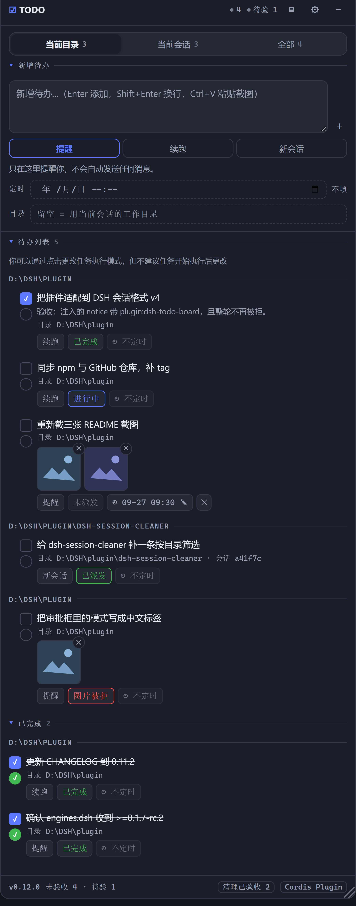
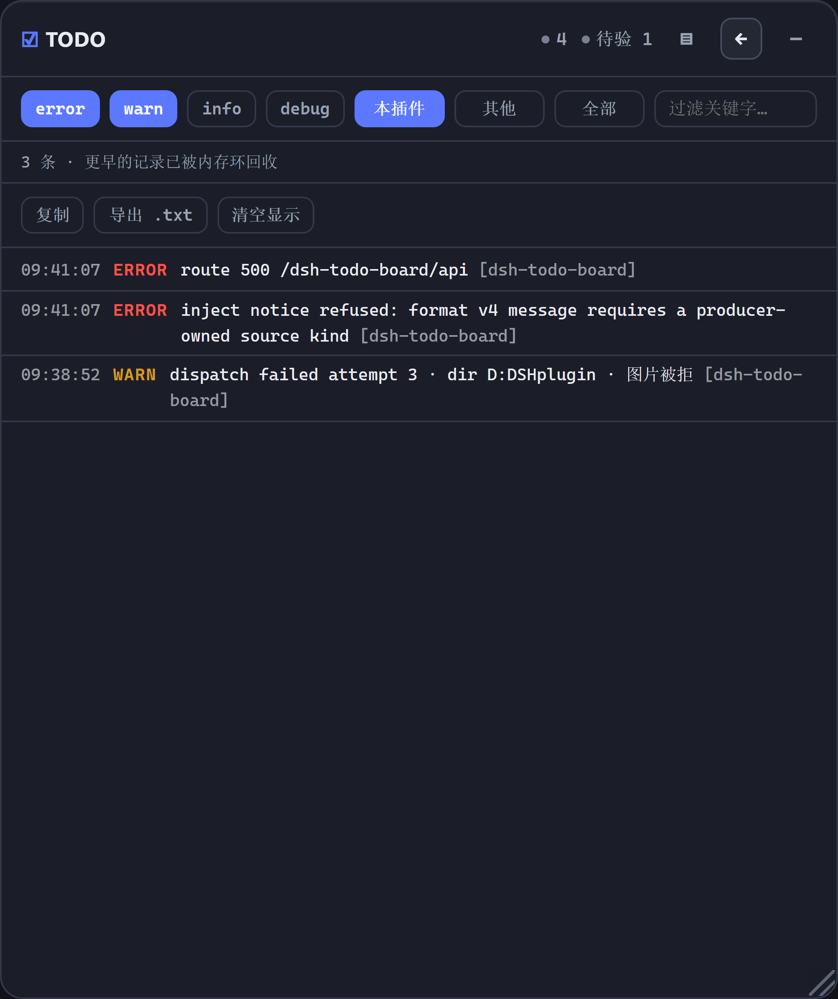
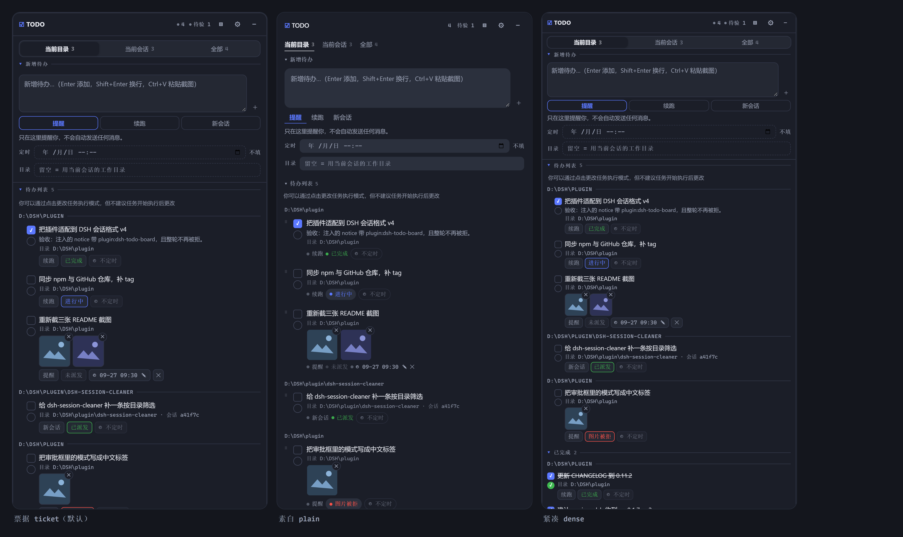

# dsh-todo-board

**给 DeepSeek Harness（DSH）agent 的一块跨会话 TODO 板：一次只派一件事，干完它自己去拿下一件。**

**A cross-session TODO board for DeepSeek Harness: hand the agent one task at a time, and it picks up the next one by itself.**

[](https://github.com/topics/dsh-plugin)
[](LICENSE)
[](package.json)
[](package.json)



---

## 它解决什么 / Why

让 AI 干完一件事之后，**自己**去待办板里找同一目录下还没做完的下一件继续干 —— 不用你盯着逐个验收，也不用一次把一堆任务塞给它、结果每件都做得半吊子。

待办按**工作目录**分组，列表顺序就是执行顺序；每条待办自己带一档执行模式（只提醒 / 自动续跑 / 自动新开会话）；AI 干完勾自己的左勾，你验收勾右勾，右勾才真正了结它。

- **面板**是一个浮窗（`shell.overlay`），拖动、缩放、折叠都在里面，位置和尺寸记在 `localStorage`。
- **板子是全局单文件**：`${DSH_HOME}/todo-board/board.json`，原子写入。面板内按目录分组显示。

Let the agent finish one thing, then look up the next unfinished task **in the same working directory** and keep going. Tasks are grouped by directory, list order *is* execution order, and only your own (round) tick closes one.

## 功能一览 / What you get

| 能力 | 一句话 |
| --- | --- |
| [跨会话自动接续](#三档执行模式--run-modes) | 回合结束时把同目录下一条未完成待办交给当前会话或新会话 |
| [三档执行模式](#三档执行模式--run-modes) | 提醒 / 自动续跑 / 自动新开会话，每条待办独立选 |
| [任务状态](#任务状态--task-states) | 每行都有且只有一个状态标签，从实时会话列表推导，永不落盘 |
| [卡住会自愈](#卡住的行不会静默卡死--a-stranded-row-recovers-itself) | 派发失败记 `lostAt` 并按退避重试，绝不静默退休 |
| [图片附件](#图片附件--attached-images) | `Ctrl+V` 粘贴截图，最多 4 张，派发时是**真正的图片** |
| [定时执行](#定时执行--scheduled-execution) | 本地时间到点才派发，列表里随时可改 |
| [双勾选](#双勾选--two-checkboxes) | 方形是 AI 自己勾的，圆形是你的验收；右勾才了结 |
| [界面风格](#界面风格--skins) | 票据 / 素白 / 紧凑三套，一键循环切换 |
| [开发者日志](#开发者日志--developer-log) | 面板内切页看日志，出错才亮小圆点，默认只记本插件 |
| [长任务先规划](#长任务先规划--plan-a-long-task-first) | 明显分多步时先问你要不要拆，`/todo` 一键注入模板 |
| [模型工具与审批门](#模型工具--the-todo_board-tool) | AI 改板子走 DSH 原生审批框，不问就执行不了 |

## 安装 / Install

```sh
dsh plugin --profile web add dsh-todo-board          # 从 npm 安装 / from npm
dsh plugin --profile web add <git-url-or-path>       # 或从仓库/本地目录 / from a repo or local path
```

安装后**重启 Profile**（重新执行 `dsh web`）才会装载 —— 本插件是 host 组合里的一行，不是运行时热加载。

Restart the profile afterwards: the plugin is a row in the host composition, not a runtime hot-load.

卸载 / Uninstall：`dsh plugin --profile web remove dsh-todo-board`

### DSH 版本要求 / DSH version requirement

**本插件 0.11.2 起要求 DSH ≥ 0.1.7-rc.2，并已在 DSH 0.2.0-rc.2（桌面端）上验证。**

| 你的 DSH | 装哪个版本 |
| --- | --- |
| 0.1.7-rc.2 ~ 0.2.0-rc.2 | 当前版本 |
| ≤ 0.1.6（含 `0.1.5-rc.3`） | `dsh-todo-board@0.6.1`（最后一版 v3 兼容版本） |

会话格式在这两端**都是 v4**，所以同一条适配覆盖两者。插件注入的每条消息都带一个**生产者自有的 source**（`{ kind: 'plugin:dsh-todo-board', form: 'notice' }`）：这是 v4 的硬性要求，旧 v3 的写法会被持久化层拒绝，而**拒绝会带走整个回合**——不只是那条提示。不带这个适配的发布版只有 **0.4.1 / 0.5.0 / 0.6.1**。

> **装错版本没有安装期告警——这是实测的。** `engines.dsh` 只是一个**声明**：npm 只校验它认识的引擎名（`node` / `npm`），自定义引擎名不参与检查（实测在 DSH 0.1.5 / 0.1.6 下安装不会有 `EBADENGINE` 警告）。实际表现是**运行时报错**，原因写进插件日志。

## 快速上手 / Quick start

1. 右上角出现浮窗，输入一条待办，选执行模式，点「添加」。
2. 让 AI 去做这件事。它做完会调用 `todo_board action=done` 给自己打左勾，然后查同目录下一条。
3. 你验收后点右勾；底部「清理已验收」批量清掉。



## 三档执行模式 / Run modes

每条待办在新增时必须选一档（默认「提醒」）。

| 模式 | 行为 |
| --- | --- |
| 提醒 | 不自动做任何事，等你在浮窗里点 ▶ |
| 自动续跑 | AI 回合结束时，把同目录下一条待办注入**当前会话**继续跑 |
| 自动新会话 | AI 回合结束时，新建一个同目录会话并执行该待办 |

新增框里的「目录」一行决定这条待办**归属哪个目录**：它决定分组标题、决定「当前目录」筛选里能否看到它，也决定回合结束后由哪个会话来接续它。**留空 = 跟随当前会话的工作目录**。

派发顺序 = 面板里**从上到下**的顺序。拖动行首 `⠿` 调整，顺序持久化。

「自动新会话」第一次派发时创建会话并**绑定**到这条待办：之后 ▶ 或回合结束自动接续都复用同一个会话，不会一次运行开一个会话。绑定会话已不在时，下一次派发才会再开一个新的；点行上的 `会话 … ✕` 解绑即可手动换一个。

## 任务状态 / Task states

每条待办的状态由 host 从**实时会话列表**推导（不落盘，避免与实际时间戳不一致）。**每一行都带且只带一个状态标签**，因为需要靠推断才知道的状态等于看不见：

| 状态 | 标签 | 含义 |
| --- | --- | --- |
| 未派发 | `未派发`（稍暗） | 还没交给任何会话；▶ 可点 |
| 已派发 | `已派发`（绿） | 已交给会话，目标会话还活着 |
| 进行中 | `进行中`（蓝） | 目标会话此刻正在跑 |
| 已完成 | `已完成`（绿字） | AI 打了左勾，或你打了右勾 |
| 目标会话丢失 | `目标会话丢失`（红） | 派发时找不到目标会话，悬住了 |

只有 `进行中` 和悬住的行显眼。`已完成` 的**划线**只跟验收走（那是你自己勾的），所以 AI 勾完但你没验收的行会显示「已完成」而依然清晰可读。

「悬住」的原因不止一种，面板按实际原因显示：`目标会话丢失`、`图片被拒`（会话是好的，别冤枉它）、`建会话失败`、`预设解析失败`、`服务不可用`；tooltip 里写清原因和出路。

**▶ 只能在「未派发」时点击。** 重复派发只会产生重复工作，而无处可去的待办应该先改模式或换目录。

### 卡住的行不会静默卡死 / A stranded row recovers itself

**派发失败不会盖上「已派发」的戳。** 那个戳的含义是"已经发出去了"，而调度器和回合结束钩子都会按它跳过——盖上就等于把这条待办永久退休，而它其实一次都没跑过。取而代之的是记录 `lostAt`，并按退避自动重试：首次 1 分钟后，逐次翻倍，最多半小时一次。改执行模式、换目录、解绑会话都会立刻清掉这个标记让它重新排队。卡住的待办也不会挡住队列后面的条目。

**任何派发失败都不会让 host 卡死。** 一条永远「到期」却又从不留下任何状态戳的待办，会让调度器的重试链纯靠微任务自我循环——事件循环一次都跑不到，整个 host 冻结。`tools/retry-loop.mjs` 是这条性质的回归守卫，已并入 `npm test`。

## 图片附件 / Attached images

待办可以带图片（最多 4 张，PNG / JPG / WebP / GIF）。图片存进 DSH 的**附件库**，派发时作为**真正的图片**和提示词一起发给模型——不是把文件名写进文字里。

- **在新增框里直接 `Ctrl+V` 粘贴截图**即可附图，粘完显示缩略图，点缩略图移除。原来的「📎 图片」选文件按钮已删除。行上的缩略图点击可放大，✕ 移除单张。
- **输入框空着时没有任何常驻提示**：能力由 placeholder 里的 `Ctrl+V 粘贴截图` 说明，附图区只在真的附了图之后才出现。
- **纯文本粘贴不受影响**：只有剪贴板里真的带图片时才会拦截粘贴。
- 一次粘太多会**粘满为止并告知**（「只粘贴了前 N 张」），而不是静默丢掉。
- 剪贴板图片有时**不带 MIME 类型**；这种会按文件名的扩展名补上类型再交给 host（host 对媒体类型是严格校验的）。
- 图片字节由本插件自己的 `GET /dsh-todo-board/image?id=…` 提供：harness 自带的图片读取是**会话作用域**的，而待办的附件存在板上，所以板自己当权威——没被任何待办引用的 id 一律 404。
- **目标模型必须支持图片**：派发前会查模型是否声明了 `image`，文本模型会得到明确提示而不是适配器抛错。

## 定时执行 / Scheduled execution

每条待办都可以带一个**本地时间**（`YYYY-MM-DDTHH:mm`，分钟精度）。到点之前不会被派发；到点之后 DSH 按它自己的模式执行它——就像你此刻按了 ▶。

- 新增框里的「定时」一行用浏览器的时间选择器挑时间；留空 = 立即可执行。
- **列表里的待办也能改定时**：没定时的行显示 `🕓 不定时`，点一下就地展开选择器；已定时的行点标签打开同一个选择器（带着当前时间），`Enter`/`✓` 保存、`Esc` 取消，标签旁的 `✕` 单独取消定时。
- 行上的定时标签显示时间，**已到点**会变黄。
- `提醒` 模式到点只弹一条桌面通知（需要浏览器通知权限）；`自动续跑` / `自动新会话` 到点才真正派发。
- 定时只判一次；错过的时间（DSH 当时没运行）会在下次启动后立刻补上。时间用**主机本地时区**解释。

## 双勾选 / Two checkboxes

| 勾 | 谁勾 | 含义 |
| --- | --- | --- |
| 左（方框） | 模型自己调 `todo_board action=done`，也可手点 | AI 已完成，等你验收 |
| 右（圆框） | 只有用户 | 已验收，真正了结 |

只有**右勾**才把待办从未完成列表里移除，系统提示段落明确禁止模型代勾右勾。

勾上右勾时这一行**从「待办列表」移走、进入「已完成」区块**——不是变灰留在原地，是真的换了一个列表。新区块在待办列表和面板之间，**最近验收的排在最上面**，按目录分组，同样可折叠。再点一次那个圆勾就撤销验收，行会回到待办列表。已完成的行不参与执行顺序：没有拖柄、也不能被拖成落点（`▶` 与 ✕ 仍然可用）。

## 界面风格 / Skins

三套界面，标题栏的 `▤` 循环切换。**默认那套就是原来的样子**，所以不切的人什么都不会变。



| 界面 | 按钮 | 它改什么 |
| --- | --- | --- |
| 票据 `ticket` | `▤` | 默认：细线分隔、等宽数字、带框的状态标签 |
| 素白 `plain` | `◻` | 去掉卡片边框与分隔线，留白更多；状态标签收成一个色点 |
| 紧凑 `dense` | `≣` | 结构同票据，字号行距各降一档，图片缩略图变小 |

**三套界面里，控件一个不多一个不少，意思也不变。** 方形的是「AI 已完成」、圆形的是「已验收」，三套都一样：那是含义，不是装饰。切换只动外观，不动任何一条数据，也不碰 DSH 的其他界面——每个皮肤规则都限定在本面板根节点之下（`npm run test:browser` 会在真实浏览器里验证这条）。

皮肤是**只加不改**的样式表：基础样式表描述 `ticket`，另外两套只声明自己不同的地方。所以某条声明写错时，退回去的是「原来那套界面」，而不是「没有样式」。

## 面板操作 / Panel

- **折叠为一行**：标题栏右侧的 `–` 把整板收成一行——`TODO · 未完成数 · 下一条待办 · 待验 N`，点这一行任意位置展开。
- **折成一行也能拖动**：按住这一行拖动即可移动它，位置和展开态共用同一份存储。**位移小于 3px 的按压仍算点击**（展开面板），拖动过就不会误触展开；窗口变窄时它按**自己那一行的实际宽度**收回视野内，而不是按面板的最小宽度。
- **切换界面**：标题栏的 `▤` 在三套界面之间循环，按钮上的字形就是当前那套。选择记在 `localStorage`（`dsh.todoBoard.skin.v1`），刷新后保持；已折成一行时也一样生效。
- **区块折叠**：面板内部三个区块（新增待办 / 待办列表 / 已完成）各自可折叠，点区块标题切换。折叠状态记在 `localStorage`，刷新后保持。
- **底部状态线（不可折叠）**：左下方常显**版本号**与**未验收数量**（有 AI 完成待验收时追加 `· 待验 N`）——它们不是可折叠区块，所以不会被折起来后"看不见就当没有"。同一行右侧是 `清理已验收 N` 与 `Cordis Plugin` 两条功能入口。
- **拖动 / 缩放**：拖标题栏移动，右下角 `◢` 缩放；位置与尺寸存进 `localStorage`，刷新保留；双击标题栏或拖柄还原。**窗口变窄时面板会自动收回视野内**（含浏览器缩放），拉宽时回到你放它的地方。
- **筛选**：当前目录 / 当前会话 / 全部，每段带未完成计数。
- **行内编辑**：双击标题改名；点模式标签在 提醒 → 续跑 → 新会话 之间循环；点定时标签改时间。**列表内部有一行小字说明「可以改模式，但任务开始执行后不建议再改」**（列表为空时不显示）。
- **备注（note）**：有备注的行在标题下方显示备注正文（最多 2 行，紧凑界面 1 行，悬停看全文）。行尾的「＋ 备注 / ✎ 备注」是它**自己的**控件：多行文本框，`Enter` 保存、`Shift+Enter` 换行、`Esc` 取消。备注**不裁剪、不设上限**，因为它是派发时一起发给模型的上下文。
- **多行输入**：新增框自动增高（3 行起步，最高 180px），`Enter` 添加、`Shift+Enter` 换行、`Ctrl+V` 粘贴截图附图。
- **开发者日志**：标题栏的 `⚙` 在同一个浮窗内切到日志页。出错时按钮上亮一个小圆点，点开看完即清。
- **Cordis 入口**：侧边栏底部的 `Cordis Plugin` 按钮折起，入口移到本面板底部；点它打开原面板，面板出现在**本面板正下方**（右对齐、互不覆盖）。找不到入口时按钮会变灰并给出提示。

## 开发者日志 / Developer log

标题栏第三个按钮 `⚙` 把面板**在同一个浮窗内**切到日志页（不是新窗口，也不进 DSH 设置页）。**平时它不出现在你的工作流里**：出问题时按钮上亮一个小圆点，点开看，看完圆点就没了。

- **过滤**：级别（error / warn / info / debug，至少保留一个）、来源（本插件 / 其他插件 / 全部）、关键字。
- **最新记录在最上面**——打开它的理由通常就是刚坏掉的那件事。
- **复制** / **导出 .txt** / **清空显示**。清空**只清面板，不动主机上的记录**。
- **默认只记本插件**（自己的 debug 也记，别的插件只收 error）。别的插件那部分**可能含它们的错误上下文**，导出前请自行确认。
- **日志正文只在日志页打开时才传给浏览器**。关着的时候面板的轮询负载和没有这个功能时**逐字节相同**，只额外带一个数字：有没有新的错误（那个圆点就是这么来的）。
- 存放位置：`${DSH_HOME}/todo-board/log.ndjson`，一行一条，上限 256 KiB（超了保留最新一半），权限 `0o600`。写不进去时**只是不再落盘，内存日志照常**。

失败路径都会留痕：派发失败（含**第几次**、目标会话、目录、原因）、读写板失败、建会话 / preset 失败、图片入库失败、路由 500，以及**被信任校验拒绝的请求**。

> **脱敏是承重结构，不是加固。** 密钥从来不是被某处不小心的 `logger.warn(secret)` 记下的，而是夹在**别人构造好的消息**里——通常是配置校验失败时的 `Error.message`（比如 MCP 服务器的 `transport` 少打一个字母，整份配置连同 `env` 和 `Authorization` 头就被打了出去）。所以**每一行落盘前都过脱敏**，导出时**再过一遍**。已知未覆盖：JSON dump 里、键名不像密钥、值也没有可识别前缀的密钥。

## 长任务先规划 / Plan a long task first

给模型一个多阶段任务时，它**应该先问一句**要不要用 TODO 板拆成步骤、按顺序做。这个能力由三部分组成：

| 谁 | 用什么 | 做什么 |
| --- | --- | --- |
| **模型** | 系统提示段落里的一条规则 | 明显分多步、且**当前目录下还没有待办**时，先问一句「要不要拆」；已经拆过就不再问 |
| **你** | `/todo <目标>` 命令 | 一句话把模板注入当前会话，模型随即给计划 |
| **你/模型** | Skill `todo-board-planning` | 拆分手册（粒度、note 写什么、模式怎么选），模型按需加载 |

### 复制这段给模型

```
用 TODO 板把这件事拆成可执行的步骤，然后按顺序做。

【目标】<一句话说清最终要什么>
【边界】<不要做什么、必须遵守什么>
【完成标准】<怎么算做完；能跑命令/看结果最好>

拆分要求：
1. 每条一句话、彼此有顺序、能独立验收；一条只交付一件事，别把两件事塞一条；
2. 先给我看拆分结果，我确认后再写进板子；我说改就改；
3. 每条待办的备注（note）里写清：验收标准 + 已知的坑/前置条件；
4. 定好顺序后，用一次 action="add" 的 items 把整份计划写进去（一次审批），不要一条一条建。

执行要求：
5. 开始后每做完一条，立刻 action="done" 勾成「AI 已完成」，再取同目录下一条继续，不要停下来问我；
6. 中途要加步骤就告诉我，别自己闷着改范围。

（我没特别说的话：默认拆 3–8 步；建好后用 ask_user_question 问我「就按这个做（立刻开始）／只建清单不开始／我再改改」。）
```

> 这段模板在代码里只有**一处**定义（`PLAN_TEMPLATE`），`/todo` 命令、Skill 正文与本 README 共用它；`tools/check-template-parity.mjs` 会逐字比对上面这个代码块，防止"文档里那份悄悄过期"。

**一次写入整份计划**：`add` 传 `items` 数组即可。一次调用 = 一次审批框（框里逐条列出每一步的标题），数组顺序即执行顺序，上限 20 条；**任意一条不合法 → 整批一条都不写**。每步可以有自己的 `mode` / `note` / `schedule` / `images`。

**执行模式怎么选**：`resume`（推荐，同一会话连跑）、`newSession`（每步开新会话，适合步骤互相独立）、`remind`（只建清单，你自己点 ▶）。模型建完后应当用 `ask_user_question` 问你，「就按这个做」就等于**你授权了第一步**。

**确定性提醒**：提示词里的规则是"软"的，所以插件还在 `agent/pre-step` 上加了一道保守判断——当这一步进来的用户消息同时满足「长度 ≥ 200 字」「出现 ≥ 2 处阶段标记」「当前目录下没有未完成待办」「这个会话还没被提醒过」，才追加一句"这看起来不止一步"。两个阈值都在 `lib/index.js`（`PLAN_NUDGE_MIN_CHARS` / `PLAN_NUDGE_MIN_MARKERS`），误报的代价只是多问一句。

## 模型工具 / The `todo_board` tool

| action | 作用 |
| --- | --- |
| `list` | 列出当前工作目录下未验收的待办（`all: true` 列全部目录），带 id、执行顺序与定时时间 |
| `add` | 新增一条（追加到底部），可带 `schedule` 与 `images`；**给 `items` 就能一次写入整份计划** |
| `done` | 打左勾「AI 已完成」 |
| `reopen` | 撤销左勾 |
| `note` | 追加备注 |
| `schedule` | 设置或取消定时时间（传空字符串即取消） |
| `update` | 改标题 / 模式 / 目录 / 备注；**先整体校验再落笔**，一个字段不合法就整条拒绝 |
| `reorder` | 传 `ids` 指定新的从上到下顺序。**只接受同一个目录内的待办**；未列出的保持原有相对顺序 |
| `dispatch` | 立即派发一条待办（等于面板的 ▶）。**只有「未派发」的能派发** |

工具输出 schema 是 `additionalProperties: false` 的严格 JSON Schema，返回值只含声明过的字段。

### AI 改板子要你批准 / Approval for board writes

**模型写板子走 DSH 的原生审批框**（`tools/pre-execute` → `ask` → `dsh-user-approval`），所以这不是提示词里的约定：不问就执行不了，而且被拒绝时模型收到的是一个**真正的失败结果**。门装在**工具注册表这一层**，在任何工具体执行之前，所以模型没有绕过的路径。

| action | 要审批吗 | 为什么 |
| --- | --- | --- |
| `list` | 不用 | 只是读 |
| `done` / `reopen` | 不用 | 这是模型自己的左勾。「做完一条就勾掉、再取下一条」就是你要的自动接续；在 `danger-full-access`（审批档 `never`）下每次都会变成拒绝，那条链子会当场断掉 |
| `add` / `note` / `schedule` / `update` / `reorder` / `dispatch` | **要** | 都是在改板子（`dispatch` 也是：它替用户启动了队列） |
| 将来新增的写动作 | **要**（默认就是"要"） | 白名单里没写的一律问——漏加一个动作必须失败关闭 |

**审批挡的是「改板子」，不是「跑队列」**：面板的 ▶、自动接续、定时到点派发都不需要审批——后两者根本不是工具调用，也在回合之外。「逐次确认」是默认，要少被打断就用 `/permission` 切档，不需要本插件实现"记住已授权"。

## 数据 / Data

`${DSH_HOME}/todo-board/board.json`（默认 `~/.dsh/todo-board/board.json`），原子写入（临时文件 + rename）。文件缺失时自动创建；读坏或写失败会在浮窗底部红字提示。待办板是全局的，面板内按目录分组。开发者日志在同目录的 `log.ndjson`。

**会话生命周期**：「自动新会话」创建的会话走 `ctx.root` + `agentPresets.mount()`：归属**应用根上下文**而不是本插件行，因此停用 / 更新 / 卸载本插件不会连带拆掉这些会话；`setup` 里挂载 agent preset，与 api-proxy 创建会话的方式一致——少了这一步新会话会没有工具和提示词。

## 结构 / Layout

```
package.json          dsh.bundle.patch → cordis.patch.yml；dsh.client.platform = web
cordis.patch.yml      向 profile 树 insert 一行 todo-board
lib/index.js          Host：板文件、todo_board 工具、审批门、回合结束钩子、提示词段落、
                      日志 exporter、/dsh-todo-board/api 与 /dsh-todo-board/image
client/client.js      Browser：shell.overlay 浮窗；三套皮肤、粘贴附图、日志页都在此
tools/                smoke / client-smoke / check-http / check-live / check-browser /
                      check-fence-parity / check-session-format / check-template-parity /
                      check-*-guard（变异检查）/ capture-fixture（重生成截图）
```

Host 半刻意不 import 任何 `@deepseek-ai/*`：profile 安装的插件从自身目录解析模块，harness 包在那里不可达，一切通过 `ctx`。

## 开发 / Development

```sh
npm run check        # node --check 两个入口
npm test             # host + client 两半 smoke、重试循环、真实 HTTP 围栏、真实 cordis 运行时、
                     # 围栏对表、会话格式、模板对表
npm run guard        # 变异测试：确认上面那些断言真的会失败
npm run test:browser # 真实浏览器里验证皮肤、粘贴与折叠拖动（需要 Chrome，可设 DSHTB_CHROME）
```

**改完客户端只需刷新页面；改 Host 半边需要重启 Profile。** 桌面端同理：客户端半边的改动由 `dsh-client-hmr` 自动发现（500ms 轮询文件 + SSE 推送），Host 半边要重启应用。

`npm run guard` 不是重复劳动：它把每个被修过的行为再改坏一次，要求测试**必须**抓到。绿的测试本身不证明什么——一条永远不会失败的断言，和没有断言是一样的。（**它会临时改写 `lib/index.js` / `client/client.js`，跑完逐字节还原**，所以别在同一时刻手动改这两个文件。）

`npm run test:browser` 补的是几类**结构上**看不到的事，所以它测的是平台而不是插件的逻辑：**皮肤**（规则可以文本正确却在层叠里被压过去）、**日志页**（被压成不可见或被裁掉的日志页，和「什么都没记」长得一模一样）、**粘贴**（Node 套件默认了剪贴板的**形状**，而形状是浏览器的事，也正是会无声变掉的东西）、**折叠后拖动**（`setPointerCapture` 与 `getBoundingClientRect` 是真的，而拖动用的就是那个 rect）。因为需要 Chrome，它不并进 `npm test`。

`tools/check-live.mjs` 补的是**stub 与真实运行时的语义差**：`smoke.mjs` 的 `inject` 是直接调回调，而真实 cordis 要等服务被 **provide** 出来才唤醒。可用 `DSHTB_CORDIS` / `DSHTB_TOOLS` / `DSHTB_SESSION` 指向任意一份 DSH 安装（含桌面端 `app.asar` 内那份）来验证兼容性。

`tools/check-fence-parity.mjs` 针对的是**"复刻会漂移"**：围栏是从 harness 那条 `isTrustedApiRequest` 复刻来的，漂移方向必然是**更松**，且没有别的测试会发现，所以它把两边谓词在 72 个 host/origin 组合上逐例对表。

### 截图 / Screenshots

```sh
node tools/capture-fixture.mjs     # 重生成 assets/screenshot-*.png（推荐：无需登录、可重复）
node tools/capture-screenshots.mjs # 从运行中的 GUI 抓图（需要那个 profile 的浏览器凭据）
```

`capture-fixture.mjs` 加载**真的** `client/client.js`，用**它自己安装的**样式表，再按组件真实渲染结构搭出固定件。**开图之前**它会断言固定件用到的每个类名都在插件样式表里声明过：类名被重命名时，固定件仍然会"渲染成功"，但它渲染的是**没有样式**的面板——而一张不存在的面板截图比没有截图更糟。

## 已知限制 / Limitations

- 浮窗每 2.5s 轮询一次 `/dsh-todo-board/api`，不是推送（日志页复用同一条轮询）。
- **模型还够不到面板的全部能力**：`remove`（删除）与 `clearVerified`（清理已验收）仍然只有面板能做——删除是不可逆的。
- **`add` 接受 `mode`（模型调用也一样）**：用户和模型都要能一次建出「续跑 / 新会话」的待办。代价是"批准创建"这一次也可能顺带批准了"自动执行"——缓解手段是审批框把模式写在理由里。
- 待办板是全局单文件，不按目录分文件。「自动新会话」需要待办上的目录路径可创建。
- 定时只支持**单次**的绝对时间，没有 cron / 周期规则；到点后「自动续跑」需要来源会话当时还在运行，否则按「没有可接续的活动会话」处理。
- Cordis 入口是 DOM 桥接：按该插件自己渲染的 `data-cordis-badge` 属性定位，用带 `!important` 的规则覆盖它计算出的位置。DSH 升级若改了这套实现，桥接会失效——那时按钮会变灰并提示，不会静默失灵。
- **日志只记本插件**，且**脱敏有已知缺口**（见上）。日志的**内存环**上限 500 条，被回收的更早记录只存在于 `log.ndjson`，面板会明说。日志页**不跨刷新保留**。

## 安全 / Security

### 一、模型写板子：审批门

见上面「AI 改板子要你批准」。它装在 `tools/pre-execute`，也就是**工具注册表这一层**，在任何工具体执行之前——所以模型没有绕过的路径，形式也不是"提示词请它先问"。

### 二、两条路由：用 harness 自己的门

两条路由（`/dsh-todo-board/api`、`/dsh-todo-board/image`）**不在 DSH 的 `/api` 通道上**（那道围栏按通道注册），所以围栏必须在这里自己装一道。做法是**优先调用 harness 自己的门**：

```
ctx.get('connection').requestRejection(request)   // dsh-client-connection
  1. isTrustedApiRequest  → Host / Origin（防 rebinding / CSRF）
  2. browserAuth.isAuthenticated → 浏览器会话凭据
```

拿不到该服务时才退回复刻版（只有第 1 件）；抛错、返回不认识的东西，一律按拒绝处理。

**为什么必须借而不是复刻**：0.9.0 只复刻了第 1 件，**漏掉了第 2 件**——而漏掉的恰恰是挡住本机进程的那一半。后果是：任何本机进程（**包括 AI 自己用的 shell**）都能直接 `POST` 这条路由改写板子，**审批门被整条绕过**；日志正文也挂在这条路由上，于是本机进程还能读到日志。旁证本来就摆在眼前：`GET /` 对裸客户端返回 **401**，本插件的路由却返回 **200**。

这条通道现在由 harness 的门堵上：**面板**（浏览器，带 DSH 自己签发的 `dsh-auth-*` 会话 cookie）照常可用；**shell 客户端拿到 401**。

复刻那道围栏（兜底用）补之前实测过的后果：不带凭据就能 `GET` 出整个板子，且 `Content-Type: text/plain` 的跨站 POST **会直接执行动作**（`text/plain` 是 CORS 安全列表值、不触发预检）——任意网页都能增删待办、甚至派发任务。`Host` 是承重项：明文 HTTP 下浏览器对**读**请求不带 `Origin` 也不带 Fetch-Metadata，而 `Host` 正是 rebinding 无法伪造的那个头。

部署在非回环地址时，用 DSH 自己的 `dsh --profile web --trusted-host <authority>` 声明，本插件按请求现读 `webRuntime.trustedHosts`；读不到就退化为仅回环。

### 三、代价与边界（说清楚，别当成没发生）

- **用脚本 / curl 直接往板子里写，从此也不可用了**——那正是要堵的那条通道。需要程序化写入就用模型工具（会走审批），或嵌进 DSH 里。
- **面板被 401 挡住的唯一情形，是浏览器没有那份会话 cookie**。那时插件日志会写明原因和解法，**面板页脚也会直接说**：用 `dsh web` 打印的那条带 token 的地址重开页面即可。
- **`danger-full-access`（审批档 `never`）下模型写板子会被确定性地拒绝**。这不是门失效，而是门变成了一堵墙。
- 本插件保证的是**这条路由**不再接受任意本机进程；它不替代 DSH 自身对整个 Web 面的安全模型。

## License

[MIT](LICENSE)
